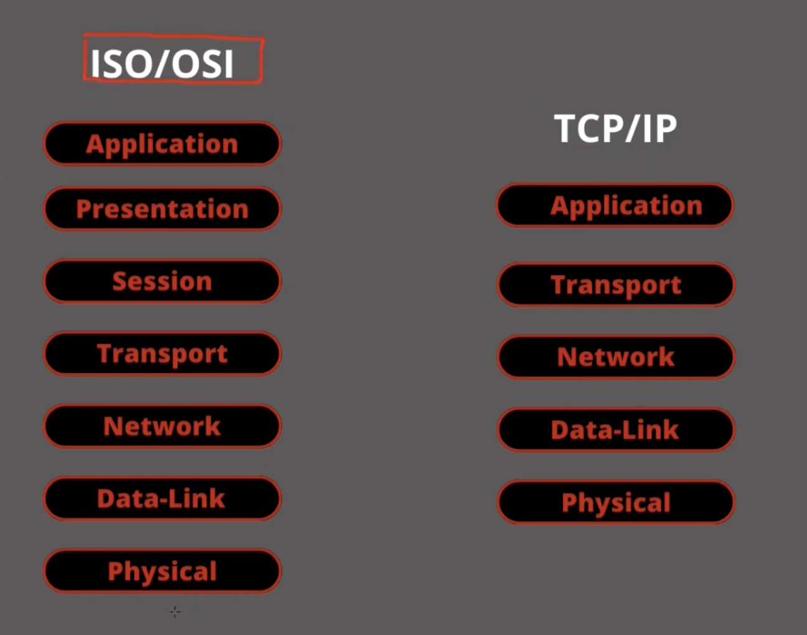

# Lesson 1

Course intro

# Lesson 2 and 3

- Internet is a graph
  - Nodes/Vertices are connected to each other, creating Links/Edges
  - It is a collection of devices interconnected, often through intermediary devices
- Networks are usually categorised by size
  - **PAN** Personal Area Network (small and local). E.g. Bluetooth, wireless devices
  - **LAN** Local Area Network: hosts communicating through switches/routers. You can connect LANs together via the Internet to form larger networks.
  - **WAN** Wide Area Network
- Protocols: ISO/OSI (theoretical) and TCP/IP (practical)
  - Initially, different organizations developed their own protocols with different rules, so hosts from different organizations could not communicate from different orgs were not able to communicate
  - It was necessary to use a shared model, first defined theoretically as the ISO/OSI model, and later implemented as the TCP/IP model
- TCP: Transport Layer
- IP: Network Layer

  

- ISO Layers:
  Each layer handles a specific type of data and has a specific direction or function

  - **Physical Layer** (1): the lowest level, responsible for moving raw bits over cables or wireless signals
  - **Data-Lin Layer** (2): Provides standards and devices for local networks. Ensures data is transmitted safely and correctly using Frames
  - **Network Layer** (3): Enables data transfer between different networks (beyond LANs) using IP.
  - **Transport Layer** (4): Creates a communication layer between hosts. In this layer you can find the UDP protocol (unreliable but faster, useful for e.g. streaming) and the TCP protocol (more reliable)
  - The **Session**, **Presentation** and **Application** are the highest layers that are increasingly closer to the user
  - Each layer is defined by its own data structure and protocol.
  - A protocol is a set of rules, typically defined in an RFC (Request for Comments).

- **TCP/IP Layers:**
  - Each layer handles a different type of entity and uses a different addressing scheme.
  - **Application Layer:** 
    - Entity: Message 
    - Addressing: e.g., email address, URL
  - **Transport Layer:** 
    - Entity: Segment
    - Addressing: ports
  - **Network Layer:** 
    - Entity: Datagram (e.g., packet, IP)
    - Addressing: IP address
  - **Data Link Layer:** 
    - Entity: Frame
    - Addressing: MAC address
  - **Physical Layer:** 
    - Entity: Bits
    - Addressing: transmission medium (e.g., cables, Bluetooth)
  - Layers interact with each other and support extensibility and modification.
  - **Adjacent Layer Interaction** occurs when a layer communicates with a different layer within the same host (e.g., Application Layer with Transport Layer).
    - Higher layers request services from lower layers.
    - Lower layers provide services to higher layers.
  - **Same Layer Interaction** occurs when layers at the same level in the stack communicate between different hosts (e.g., Application Layer in Host A with Application Layer in Host B).
    - This is a virtual or logical connection; direct communication at the same layer does not physically occur.
    - In reality, Host A passes data down its protocol stack, encapsulating it at each layer, and sends it to Host B, which then decapsulates the data layer by layer until it reaches the corresponding layer.
    - For example, in Application Layer communication between A and B:
      - The Application Layer in A generates a payload and sends it to the Transport Layer.
      - The Transport Layer in A adds its own header/trailer and passes the new payload to the Network Layer.
      - This process continues down to the Physical Layer (encapsulation).
      - The payload is transmitted to the Physical Layer in B, which begins the decapsulation process: unpacking the headers/trailers and passing the data up the stack until it reaches the originating layer.

# Lesson 4

- Encapsulating / Decapsulating example with Cisco Packet Tracer
- Well-known ports: depending on the service, there are some standard ports (i.e. TCP port 80 for HTTP servers, UDP port 53 for DNS servers)

